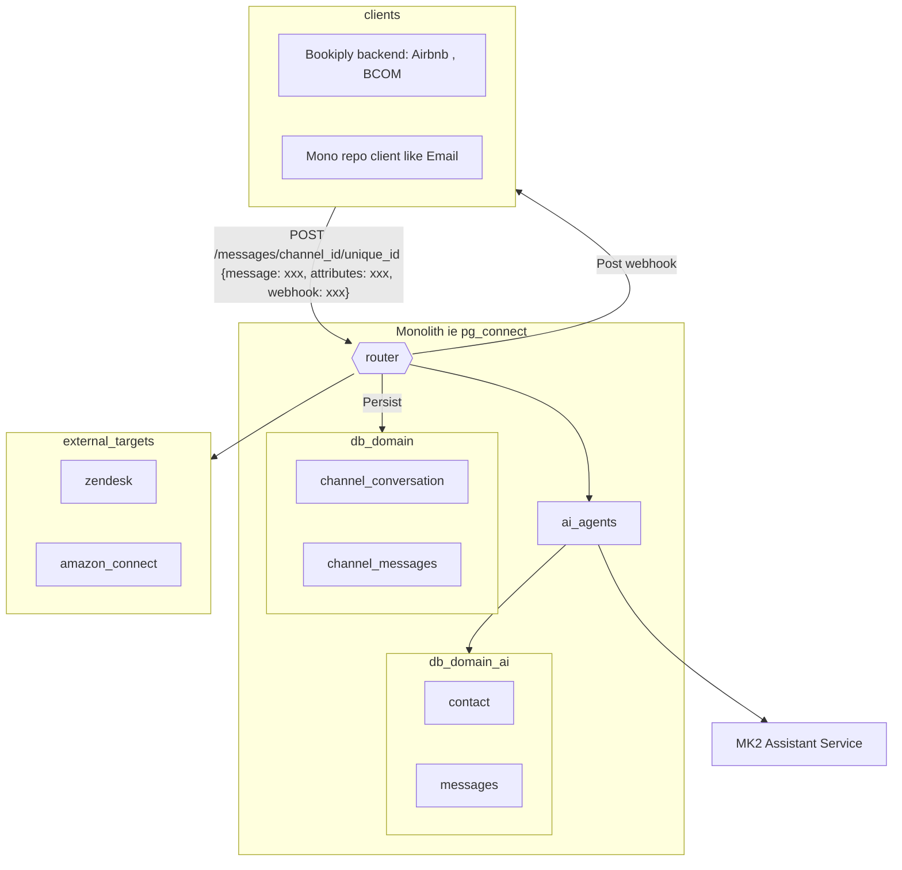

```mermaid 
flowchart TB
    subgraph clients
        bookiply_backend["Bookiply backend: Airbnb , BCOM"]
        mono_repo_client["Mono repo client like Email"]
    end

    subgraph wa_monolith[Monolith ie pg_connect]
        
        router{{router}}
        subgraph db_domain
        channel_conversation
        channel_messages
        end
        
        ai_agents
        subgraph db_domain_ai
          contact 
          messages
        end
    end

    subgraph external_targets
        zendesk
        amazon_connect
    end

    clients-->|"POST /messages/channel_id/unique_id {message: xxx, attributes: xxx, webhook: xxx} "|router
    router-->|Persist|db_domain
    router-->ai_agents
    router-->external_targets

    router-->|Post webhook|clients
    ai_agents-->db_domain_ai
    ai_agents-->mk2[MK2 Assistant Service]

```
